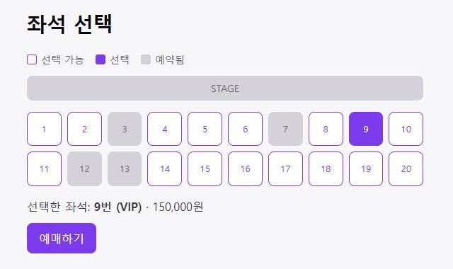

# InMyTicket Frontend

[](https://github.com/dongri-p/InMyTicket_JPA_frontend/actions/workflows/ci.yml)

티켓 예매 사이트 InMyTicket의 React 화면입니다. 프로젝트 전체 소개와 백엔드에서 고민한 내용은 [백엔드 README](https://github.com/dongri-p/InMyTicket_JPA)에 있습니다.

**데모: https://inmyticket.duckdns.org**

로그인 화면의 "체험 계정으로 둘러보기" 버튼을 누르면 가입 없이 써볼 수 있습니다. 결제는 실제로 청구되지 않는 가상 결제입니다.



## 기술 스택

React 19, Vite, React Router, Axios, oxlint

## 화면

| 경로 | 화면 | 로그인 필요 |
| --- | --- | --- |
| `/login` | 로그인 (체험 계정 버튼) | - |
| `/signup` | 회원가입 | - |
| `/` | 공연 목록 | O |
| `/performances/:performanceId` | 회차 선택 | O |
| `/seats/:scheduleId` | 좌석 선택, 예매 | O |
| `/payment/result` | 결제 결과 | O |
| `/my-reservations` | 내 예매 목록, 예매 취소 | O |

## 만들면서 신경 쓴 것

- **로그인 처리**: JWT는 `localStorage`에 저장하고, Axios 인터셉터가 요청마다 `Authorization` 헤더를 붙입니다. 토큰이 만료됐으면 보내기 전에 지우고, 로그인이 필요한 화면은 `RequireAuth`가 로그인 화면으로 보냅니다.
- **결제 요청이 두 번 나가지 않게**: 개발 모드의 StrictMode에서는 `useEffect`가 두 번 실행됩니다. 그래서 결제 화면에 들어오면 결제 요청이 두 번 나갔습니다. `useRef`로 이미 요청했는지 기억해서 한 번만 보내게 했습니다.
- **좌석 선택**: 처음엔 라디오 버튼 목록이었는데, 좌석 배치가 눈에 보이게 그리드로 바꿨습니다. 이미 예약된 좌석은 회색으로 막고, 고른 좌석의 번호와 가격을 아래에 보여줍니다.
- **예매 취소**: 결제 대기·결제 완료 상태에서 공연 시작 전일 때만 취소 버튼을 보여줍니다. 결제 완료 건은 환불 통신 때문에 1.5초 정도 걸려서, 그동안 버튼을 막아 두 번 눌리지 않게 했습니다.
- **HTTP에서 흰 화면**: 결제 키를 만들 때 쓴 `crypto.randomUUID()`가 HTTPS나 localhost에서만 동작해서, IP(HTTP)로 배포했을 때 결제 화면이 흰 화면이 됐습니다. `crypto.getRandomValues()`로 대신 만들도록 하고, 서비스도 HTTPS로 옮겼습니다.

## 로컬 실행

백엔드(`http://localhost:8080`)를 먼저 띄운 뒤 실행합니다.

```bash
npm install
npm run dev
```

API 주소는 `VITE_API_BASE_URL`로 바꿀 수 있고, 없으면 `http://localhost:8080`을 씁니다.

## 빌드와 배포

`Dockerfile`은 Node로 빌드한 정적 파일을 Nginx로 서빙합니다. `VITE_API_BASE_URL`은 빌드할 때 번들에 들어가서 build arg로 넘깁니다.

`main`에 push하면 GitHub Actions에서 lint와 빌드를 통과한 경우에만 이미지를 GHCR에 올리고, EC2가 그 이미지를 받아 배포합니다. 운영에서는 이 저장소의 `nginx.conf` 대신 [InMyTicket_deploy](https://github.com/dongri-p/InMyTicket_deploy)의 설정(HTTPS, `/api` 프록시)을 씁니다.

## 아쉬운 점

- 화면 스타일은 기본 CSS만 정리한 수준이고, 공연 포스터나 상세 정보는 아직 보여주지 않습니다.
- 결제는 버튼을 누르면 바로 가상 승인되고, 실제 PG 결제창 같은 단계는 없습니다.
- 토큰을 `localStorage`에 두고 있어서 XSS에 취약할 수 있습니다. httpOnly 쿠키 방식은 적용하지 않았습니다.
